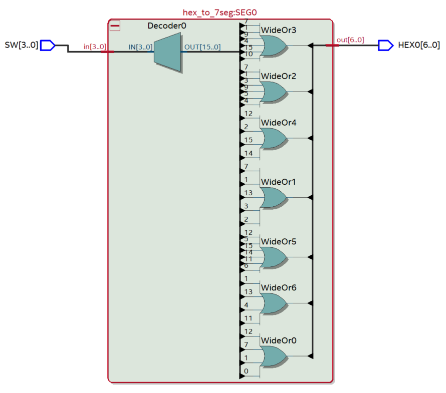

EIE2: Information Processing

# Lab 1 Documentation

## Lab 1 Overview
### Contents
Task 0 - Setting Up
Task 1 - The Design Flow – 7 Segment LED Display
Task 2: Explore Netlist Viewer and Timing Analyzer

### Structure
```
.
├── README.md
├── images
├── lab1-docs
├── mylib
│   ├── pin_assignment.txt
│   ├── hex_to_7seg.v
│   └── task2_top.v
├── task0
│   └── lab1task1_sol.sof
├── task1
│   │   
│   :
│   ├── hex_to_7seg.v
│   ├── output_files
│   │   │
│   │   :
│   │   └── task1_top.sof
│   └── task1_top.v
└── task2
    │   
    :
    ├── hex_to_7seg.v
    ├── output_files
    │   │
    │   :
    │   └── task2_top.sof
    └── task2_top.v
```

## Task 0 - Setting up
Throughout the Information Processing Module, the DE10-Lite FPGA (10M50DAF484C7G) is utilised.
An FPGA is composed of:
- **CLB**/Configurable Logic Blocks for Boolean execution and contain LUTs, flip flops/registers and multiplexers. Allowing for custom digital circuits
- **LUTs**/Look Up Tables store precomputed truth tables for logic functions and enable combinational logic
- **DSP** - Fast arithmetic operations
- Timing is done by PLLs (Phase-Locked Loops) and DLLs (Delay-Locked loops)
This specific FPGA comes with the following features:


This task is concerned with testing the fpga and ensuring that it functions as expected.
This is done by running [`lab1task1_sol.sof`](./task0/lab1task1_sol.sof).  

To run this:
- Navigate to `Tools`, `Programmer`
- Ensure that Hardware setup is `USB Blaster`
- Upload the file via `Add File`
- Click `Start`

## Task 1
**Project Setup**
- First creating a new project by `File > New Project Wizard`
- Device Assignment: `Assignments -> Device` then select `10M50DA484C7G`

**Design File**
- Design file for decoder called `hex_to_7seg.v` by `File > New` 
- Verify this by `Processing > Analyze`
- Add to project by `Project > Add Current file`

**Top-level Specification**
- Create the file `task1_top.v`
- Specify as top-level design by `Project > Set as Top-level Entity`
Verify the entire system works by `Process > Start > Start analysis & elaboration`

**Pin Assignment**
Associate design with physical pins of the FPGA, by assigning 2 of 11 pins by:
- `Assignments > Pin Planner`
This can be done by either:
- Manual config of the pins.
- Editing the Quartus Setting File (`*.qsf`):
	- Pin assignment: `set_location_assignment`
	- Setting a voltage (high/low): `set_location_assignment`

**Running on Board**
Now click on `Processing > Start Compilation` or `Ctrl+L`
This tests the code and generates the `.sof` bit-stream file.
`Tools > Programmer > Start`.

## Task 2
### RTL viewer
We can View the graphical view of the synthesised design. 
This is shown by `Tools > Netlist Viewers > RTL Viewer` 
Thus showing:


The left side shows the inputs, switches 3 to 0 with 3 being the MS.
The right side showing the outputs (7 seg display).
We can see this in more detail by clicking on it:


Looking at the Technology Map Viewer post mapping, we can see that only 1 7 segment display is being used and every bar is determined by this with 0 at the top, going clockwise and 6 in the centre.
We notice that every cell has a combination of the switches through gatewise manipulation. For the first cell this is: `OUT = A & (D # B $ C) # !A & (B # C $ D)`:
- AND: `&` 
- OR: `|`
- XOR: `#` 
- XNOR: `$`
This is the expression executed by the Logic Elements/LUTs. With this specific Max10 FPGA, we have 50 000 LEs, thus ~37500 LUTs (4 input).
Simplifying the expression we see that there are 2 separate parts, taking 3 LUTs for the complete operation. Since there are 2 inputs per LE, we have `2^3` LEs or 8LEs which matches the compilation report. And 4 pins are used for the switches + 7 for the 7seg display which is 11 pins in total.

### Timing Analyser
By clicking on `Tools > Timing Analyser` we can view the minimum propagation delay. This shows the 4 areas for:
- Rise to Rise
- Rise to Fall
- Fall to Fall
- Fall to Rise
With timings for each of them.

This is simulated to operate at 85°C representing a high-temperature worst case scenario. The maximum delay is observed with input SW[1] and output HEX0[6] with a delay of 9.316ns (FF delay).

This high temperature is the worst case since at 85°C, the charge carriers mobility is reduced within the transistors thus increasing propagation delay.

### All 10 switches
A simple fix is to add 2 more outputs to the top level module for each of the 3 segment displays. 
We can then have 3 registers responsible for internal calculations. These are responsible for the least significant hex value to the most significant based on combiantional logic:

```verilog	
	reg [3:0] seg0, seg1, seg2;

	always @ (*) begin
		 seg0 = SW % 16;  
		 seg1 = (SW / 16) % 16;    
		 seg2 = (SW / 256) % 16;
	end
```

Then we can associate these with the actual values on the 7 segment displays in the following format:

```
    --- 0 ---
    |       |
    5       1
    |       |
    --- 6 ---
    |       |
    4       2
    |       |
    --- 3 ---
```
This can be achieved by calling the original `hex_to_7seg.v` script:
```verilog
hex_to_7seg seg_display<X> (
		 .out(HEX<X>), 
		 .in(seg<X>)
	);
```
Where `<X>` iterates between 0 and 2 for each of the 3 segment displays. Thus achieving values from `0x000` to `0x3ff` for the states determined by the switches ranging to `2^10 - 1 = 1023`.

