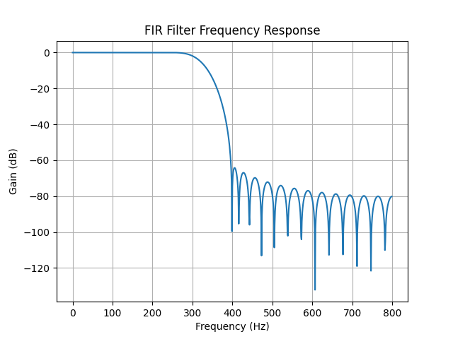
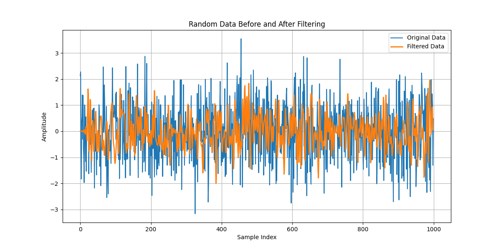
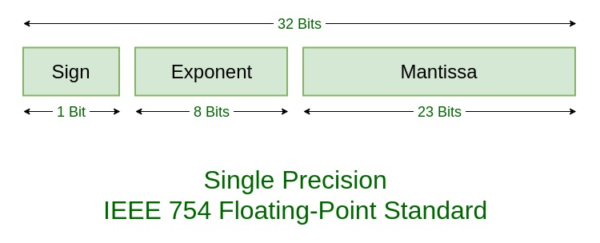

The aim for this lab is to, again, develop an NIOS II system but using SPI this time. In addition, we will make use of the accelerometer and read values from this, processed by a low-pass FIR.

## Table of Contents
1. [Background](#background)
2. [Task 1: Interface an accelerometer to a NIOS II system](#task-1-interface-an-accelerometer-to-a-nios-ii-system)
3. [Task 2: Understanding of the code](#task-2-understanding-of-the-code)
4. [Task 3: Implementing an FIR filter to process data](#task-3-implementing-an-fir-filter-to-process-data)
5. [Challenge: FIR optimisation](#challenge-fir-optimisation)

---
## Background
A typical IoT system is configured with a sensor and a processor. 

**Accelerometer**: Analog Devices' ADXL345. 3 axis and communication with SPI/I2C producing a 16 bit output.

The accelerometer is connected to the pins of the FPGA, so designing an nios ii system, allows for an SPI interface and making use of 58 internal registers with memory mapped through two 8-bit registers (Address and Data).

**SPI (Serial Peripheral Interface)**:
This is used for synchronous serial communication and is especially useful for short distances, embedded systems and duplex communication with a master slave combination.
This makes use of the following logic signals: 
- SCLK: Serial Clock
- MOSI: Main Out Slave/Sub In
- MISO: Main In Slave/Sub Out
- CS: Chip Select
Similarly, there are also UART (used for Nios II to FPGA communication) and I2C:

**UART (Universal Asynchronous Receiver-Transmitter)**:
Asynchronous Serial Communication for medium distance, embedded systems between microcontrollers and point to point connection. Asynchronous means it transmits data packets with start and stop bits. Using the logic signals:
- TX (Transmit)
- RX (Receive)

**I2C (Inter-Integrated Circuit)**:
Synchronous Serial communication for short distances especially for low-speed devices in embedded systems. This is Multi-master and multi-slave architecture with a shared bus (multi device):
- SCL (Serial Clock)
- SDA (Serial Data)

Here, JTAG UART (Joint Test Action Group UART) is used for communication between the FPGA and Nios II system since it does not require the physical board for connections. 

Using SPI here means that it has high speed capabilities with a simple handshake with 4 buses to streamline communication. (Bidirectional with low packet loss)
 

The accelerometer values can be read by using a `LookUp()` function, and `convert_read()` to convert the x_value to led and level pair:
```C
int main() {
    alt_32 x_read;
    alt_up_accelerometer_spi_dev * acc_dev;
    acc_dev = alt_up_accelerometer_spi_open_dev("/dev/accelerometer_spi");
    if (acc_dev == NULL) { // if return 1, check if the spi ip name is "accelerometer_spi"
        return 1;
    }

    timer_init(sys_timer_isr);
    while (1) {
        alt_up_accelerometer_spi_read_x_axis(acc_dev, &x_read);
        // alt_printf("raw data: %x\n", x_read);
        convert_read(x_read, &level, &led);
    }

    return 0;
}
```

**FIR filter**
As sampling the data at a specific rate may not be smooth, we can make use of a low-pass filter that reduces glitches and makes this smoother. This is a moving average with a 5-tap filter, may be extended to N-tap.
This produces a magnitude response curve with a flat passband and ripples in the stopband (> 300 Hz), equivalent to a Chebyshev filter:


Finally the program can be optimised by:
- Converting floats to fixed-point values
- Observing the impact on performance and results

---
## Task 1: Interface an accelerometer to a NIOS II system
We begin by opening the provided `.qpf` file in Quartus and adding the following connections in the Platform Designer:
- Nios II Processor (Nios II/e)
- On Chip Memory
- JTAG UART
- PIO for LED
- Interval Timer
- Accelerometer SPI mode

  
  
Refer to [lab2-docs](lab2-docs.md) for more detail on this.
Assigning base addresses, handling errors (reset vector memory and exception vector memory) gives:

We can now generate the HDL and add this into our project in Quartus.

To connect this, we can add the valid changes to the generate reg/wire declarations from `nios_accelerometer_inst.v`:
```Verilog
	nios_accelerometer u0(
		.clk_clk                                            (MAX10_CLK1_50),                                            
		.reset_reset_n                                      (1'b1),                                      
		.led_external_connection_export                     (LEDR[9:0]),                     
		.accelerometer_spi_external_interface_I2C_SDAT      (GSENSOR_SDI),      
		.accelerometer_spi_external_interface_I2C_SCLK      (GSENSOR_SCLK),     
		.accelerometer_spi_external_interface_G_SENSOR_CS_N (GSENSOR_CS_N), 
		.accelerometer_spi_external_interface_G_SENSOR_INT  (GSENSOR_INT[1])   
	);

```

SPI is evident here due to `SDI` (Serial Data In) and `SCLK` (Serial Clock) from the master to the slave device:
- MOSI (SDI) ↔ `accelerometer_spi_external_interface_I2C_SDAT`
- SCLK ↔ `accelerometer_spi_external_interface_I2C_SCLK`
- CS ↔ `accelerometer_spi_external_interface_G_SENSOR_CS_N`
- Interrupt ↔ `accelerometer_spi_external_interface_G_SENSOR_INT`

We can go to `Project > Add/Remove Files in Project` and add the `nios_accelerometer.qsys` files.

Compiling the design produces this flow summary:


Now to set up Eclipse:
We open a new workspace and navigate to `New > Nios II Application and BSP from Template`. Here we choose `nios_accelerometer.sopcinfo` and the Hello World Small template.

At this stage, we go back to the Quartus platform and run the `.sof` file.

Next, we can generate the BSP from `hello_world_sw_bsp > Nios II > Generate BSP`, then build the project to generate the `.elf` file. Finally running the configuration.

Now we can copy the program in [led_accelerometer_main.c]( ../lab3/src/led_accelerometer_main.c) which:
- **Includes Required Libraries:** Imports hardware-specific libraries for SPI (accelerometer), timer, and GPIO to control LEDs.
- **Defines Constants and Variables:** Constants `OFFSET` and `PWM_PERIOD` are defined, along with variables for PWM control (`pwm`), LED pattern (`led`), and accelerometer level (`level`).
- **LED Control Function:** `led_write()` writes LED patterns using memory-mapped I/O to the FPGA's LED peripheral.
- **Data Conversion:** `convert_read()` adjusts accelerometer readings, computes an LED pattern, and determines PWM intensity based on the tilt.
- **Timer Interrupt Service Routine (ISR):** `sys_timer_isr()` updates the LEDs dynamically, cycling brightness and direction based on the PWM and tilt level.
- **Timer Initialization:** `timer_init()` configures the FPGA's timer for periodic interrupts and links the ISR.
- **Accelerometer Initialization:** The `main()` function initializes SPI communication with the accelerometer hardware.
- **Data Reading Loop:** Continuously reads x-axis data from the accelerometer in the main loop.
- **Data Processing:** The accelerometer data is converted into a PWM level and LED pattern via `convert_read()`.
- **Real-Time LED Updates:** The ISR updates LED states dynamically in response to accelerometer data and PWM cycles.

Thus creating a bubble which goes up/down as the board is rotated. Like a bubble leveller.

---
## Task 2: Understanding of the code

The `int main()` function sets up the accelerometer and `x_read` and initiates the timer.
Then runs the following script continuously:
```C
alt_up_accelerometer_spi_read_x_axis(acc_dev, & x_read);
convert_read(x_read, & level, & led);
```
This retrieves the value for the x-axis from the accelerometer and maps this to the LED pattern by `convert_read()`.

```C
void convert_read(alt_32 acc_read, int * level, alt_u8 * led) {
    acc_read += OFFSET;
    alt_u8 val = (acc_read >> 6) & 0x07;
    * led = (8 >> val) | (8 << (8 - val));
    * level = (acc_read >> 1) & 0x1f;
}
```
This function starts by being a 9-bit value in 2's complement. With the sign bit as the direction of acceleration.
The value is first adjusted by the `OFFSET = -32` to **centre the reading around 0**. then it shifts the value by 6-bits to the right and masks it with `0b111` resulting in a **reduced resolution but mapped a result between 0 and 7**.
Then we perform the bitwise OR between `0b1000` right shifted by `val` and `0b1000` left shifted by `8 - val`.

| (8 >> val)  | (8 << (8 - val)) | * led           |
| ----------- | ---------------- | --------------- |
| 1000        | 1000 0000 0000   | 1000 0000 1000  |
| 0100        | 0100 0000 0000   | 0100 0000 0100  |
| 0010        | 0010 0000 0000   | 0010 0000 0010  |
| 0001        | 0001 0000 0000   | 0001 0000 0001  |
| 0000 . 1000 | 1000 0000        | 1000 000 . 1000 |
| ...         | ...              | ...             |

This shows a symmetric pattern forming.

Finally we can determine the brightness by performing a right shift of the original value by 1 position, masking it with `0b0001 1111`.

By `* led` we directly change the value where the pointer `led` points to.

To light up the LEDs, we use the timer, which writes at a specific rate via `sys_timer_isr()` which is an interrupt service routing executed when a specific interrupt is received. This function also uses pwm which uses the `convert_read()` function to create a smooth effect on the LEDs.

---
## Task 3: Implementing an FIR filter to process data

### 5-tap Filter
To implement an FIR filter we can add a function that takes the current reading of the accelerometer and returns the filtered version.

For a 5-tap filter, we can define a constant: `#define NUM_TAPS 5`.
For the function layout, we calculate the moving average which can be done by using a circular buffer to store the most recent values.
We also need the filter coefficients which can be determined by an array of (NUM_TAPS) values.

Researching allows us to understand that and FIR filter works based on the dot product of the filter coefficients and the buffer.


$$output = \bf{buffer} \cdot \bf{coefficients} = \begin{bmatrix} 
RecentVal1\\ 
RecentVal2\\ 
RecentVal3\\ 
RecentVal4\\ 
RecentVal5 \end{bmatrix} \cdot \begin{bmatrix} 
0.2 \\ 
0.2 \\ 
0.2 \\ 
0.2 \\ 
0.2 \end{bmatrix}$$

https://flylib.com/books/en/2.729.1/convolution_in_fir_filters.html

This is equivalent to the discrete convolution between the filter coefficients and the input signal values.

The logic follows:
- Append the most recent reading to the buffer
- find the sum of all the values (discrete convolution)
- increment the buffer index
- return output
```C
float fir_filter(float current_reading) {
	static float buffer[NUM_TAPS] = {0};
	static int buffer_index = 0;
	float coefficients[NUM_TAPS] = {0.2, 0.2, 0.2, 0.2, 0.2};
	float output = 0.0;

	buffer[buffer_index] = current_reading;
	
	for (int i = 0; i < NUM_TAPS; i++) {
		output += coefficients[i] * buffer[(buffer_index - i + NUM_TAPS) % NUM_TAPS];
	}
	
	buffer_index = (buffer_index + 1) % NUM_TAPS;
	
	return output;
}
```
There were a few key design decisions:
- static buffer and `buffer_index` to prevent losing this when we exit the function
- the buffer index:
	- If `i`>`buffer_index`, then it becomes a negative index which throws back an error in C, so we add `NUM_TAPS` and perform the modulo function on this to limit it between 0 and `NUM_TAPS - 1`

We can then put this in the `main()` function by:
```C
        float filtered_reading = fir_filter(x_read);
        convert_read(filtered_reading, & level, & led);
```


### N-tap filter
We can modify our existing system, adding N values for the coefficients.
To determine the coefficients, we can either use Matlab or make use of the python library `scipy`.
Looking at the `firwin()` function, we can use this to design an fir filter with the required coefficients.
This has the parameters `def firwin(numtaps, cutoff, fs, ...)` from the scipy documentation.

For this we need to identify the number of taps (given as an input, `n`), sampling frequency and cutoff. From the diagram provided, we known this is 300 Hz, by inspection. The sampling frequency needs to match the accelerometer's SPI clock frequency which we can find from the output data rate parameter in the datasheet for [Analog Devices' ADXL345](https://www.analog.com/media/en/technical-documentation/data-sheets/adxl345.pdf). Considering the Nyquist Sampling theorem, the $ODR > 2f_{cutoff}$. We can determine this by taking a look at the code provided in the challenge:
```C
# include “alt_types.h”
# include “sys/times.h”
…
clock_t exec_t1, exec_t2;
exec_t1 = times(NULL); // get system time before starting the process

// The code that you want to time goes here
// some code…
// till here
exec_t2 = times(NULL); // get system time after finishing the process
printf(" proc time = %d ticks \n", int(exec_t2-exec_t1));
```
This will take the system time before and after the process and output this to the user. We also need to specify this in the BSP by `BSP (right click) > NIOSII > BSP editor > Main > Settings > common > hal > timestamp_timer` and setting the value to timer. Then regenerate the BSP.

```python
from scipy.signal import firwin

num_taps = 5
fs = 1600 # Sampling Rate
cutoff = 300 # Passband frequency

coefficients = firwin(num_taps, cutoff, fs=fs)
print(coefficients)
```
produces the output `[0.01266958 0.22347362 0.52771361 0.22347362 0.01266958]`.

[../lab3/coefficients2.py](../lab3/coefficients2.py)
We can take a step further to achieve more accurate results by using the parameters provided with the matlab script to consider the following high level specifications for the low-pass FIR/Chebyshev filter:
- Sampling Rate: 1600 Hz
- Passband Frequency = 300 Hz
- Stopband Frequency = 350 Hz
- Passband ripple = 0.5
- Stopband ripple = 65

We can also obtain the:
- frequency response
	- Plotting the Gain (dB) vs Frequency (Hz) 


- filter effect
	- We intend to see reduced distortion which can be simulated with random data points and plotting both (overlay).


The images above show this for `Num_taps = 45` 

---
## Challenge: FIR optimisation
With more taps, the execution time increases linearly. Since Nios/e does not have support for floating point operations, current multiplication and addition operations are performed via fixed point, resulting in the sampling rate decreasing.

System performance can therefore be increased by converting floating-point operations to fixed-point. This can be achieved by altering the previous implementation with an input - a quantised version of the filter coefficients and perform the necessary operations under fixed point.

The current method to filter the values using the FIR filter is by using a buffer with a moving average and performing the convolution (i.e. dot production - addition and multiplication) with the coefficients for the n tap filter to find the filtered value:
```C {.line-numbers}
float fir_filter(float current_reading) {
	static float buffer[NUM_TAPS] = {0};
	static int buffer_index = 0;
	float coefficients[NUM_TAPS] = {0.2, 0.2, 0.2, 0.2, 0.2};
	float output = 0.0;
	buffer[buffer_index] = current_reading;
	for (int i = 0; i < NUM_TAPS; i++) {
		output += coefficients[i] * buffer[(buffer_index - i + NUM_TAPS) % NUM_TAPS];
	}
	buffer_index = (buffer_index + 1) % NUM_TAPS;
	return output;
}
```

### Quantise coefficients
By referencing coefficients as float data types, and the buffer also being float, it results in floating point multiplication resulting in a much higher time complexity than integer multiplication, with performance degrading as number of taps increases.

So we need to convert values like `0.2` to fixed point integers.

One way to do this is to recognise that floating point values follow the IEEE-754 standard. This is a single precision value:

Similarly, we can define a mantissa and an exponent.
So while storing the values, we have $x \times 2^{exponent}$ which is in integer form (normalising the mantissa). We can keep the values in this form for multiplication since the exponent is constant and we can dequantise the output prior to return values.
Using a `Q15.16` format ([a standard which optimises the range and precision for low cost DSPs](https://www.allaboutcircuits.com/technical-articles/fixed-point-representation-the-q-format-and-addition-examples/)) -> a total of 32 bits, we can define a `Q` value of `16`, and the `exponent` = $2^Q$ = `1 << Q`.
Then applying these on all the inputs defined as `int32_t`.

This means that our outputs are 32 + 32 = 64 bits.

> To get these data types in C, we need to add the `<stdint.h>` library.

**Libraries and constants**
```C
#include <stdint.h>

#define NUM_TAPS 5
#define Q 16
#define EXPONENT (1 << Q)
```

**Variable declarations**
```C
    static int32_t buffer[NUM_TAPS] = {0};
    static int buffer_index = 0;
    const int32_t coefficients[NUM_TAPS] = {
        (int32_t)(0.2 * EXPONENT), 
        (int32_t)(0.2 * EXPONENT),
        (int32_t)(0.2 * EXPONENT),
        (int32_t)(0.2 * EXPONENT),
        (int32_t)(0.2 * EXPONENT)
    };
	int64_t output = 0;
```

**Dequantisation**
```C
    return (int32_t)(output / EXPONENT);
```

Wrapping these inside the function `fir_filter_fixed` and adding the previous functionality, we can obtain the complete function:
```C
#include <stdint.h>

#define NUM_TAPS 5
#define Q 16
#define EXPONENT (1 << Q)

int32_t fir_filter_fixed(int32_t current_reading) {

    static int32_t buffer[NUM_TAPS] = {0};
    static int buffer_index = 0;

    const int32_t coefficients[NUM_TAPS] = {
        (int32_t)(0.2 * EXPONENT), 
        (int32_t)(0.2 * EXPONENT),
        (int32_t)(0.2 * EXPONENT),
        (int32_t)(0.2 * EXPONENT),
        (int32_t)(0.2 * EXPONENT)
    };

    buffer[buffer_index] = current_reading;

    int64_t output = 0;
    for (int i = 0; i < NUM_TAPS; i++) {
        output += (int64_t)coefficients[i] * buffer[(buffer_index - i + NUM_TAPS) % NUM_TAPS];
    }

    buffer_index = (buffer_index + 1) % NUM_TAPS;
    return (int32_t)(output / EXPONENT);
}
```


### Results and acquiring a quantitative metric
While we can clearly see a visual difference in speed since the optimised FIR is , we also need a quantitative metric to provide further information on each system's performance i.e. the time per sample or the sampling rate. 
We can use the method above, but after numerous attempts - there seems to be an issue with my RTC locally. Instead I am attempting to use the in built clock.
This should still provide a reasonable estimate since the % error is still far too low.

Using the system RTC, we use my CPU's clock rate which is $2.2 G Hz$, in the worst case scenario if the sampling frequency is $3200 Hz$ then there is an error of $1.45 \times 10^{-6} \space \%$. 
Using the FPGA's clock rate of $50MHz$, this becomes an error of $64 \times 10^{-6} \space \%$ which is still negligible when considering sampling frequencies of 800 to 3200 Hz.

>[!NOTE]
>After several tries, there seems to be a local issue as the time continues to be 0. After reconfiguring the hardware ([../lab3/CLOCKED](../lab3/CLOCKED)) and adding a second timer for the sampling frequency, it results in a time period of 65535635, test using:
>```C
>alt_u16 period_low = IORD_ALTERA_AVALON_TIMER_PERIODL(TIMER1_BASE);
>alt_u16 period_high = IORD_ALTERA_AVALON_TIMER_PERIODH(TIMER1_BASE);
>printf("Timer Period: %u%u\n", period_high, period_low);
>``` 
>Which is not correct since the low and high period registers are initialised to `0xFFFFFFFF` = 4294967295 suggesting a potential memory corruption or a configuration error.


| Model                  | Average sampling frequency |
| ---------------------- | -------------------------- |
| Initial (no filtering) |                            |
| FIR Filter             |                            |
| Optimised FIR          |                            |

