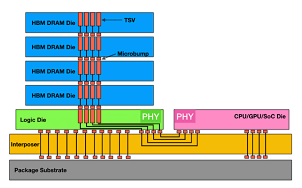
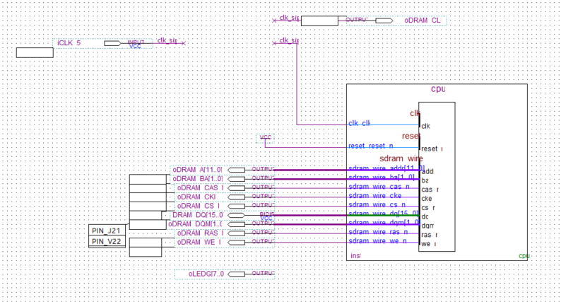
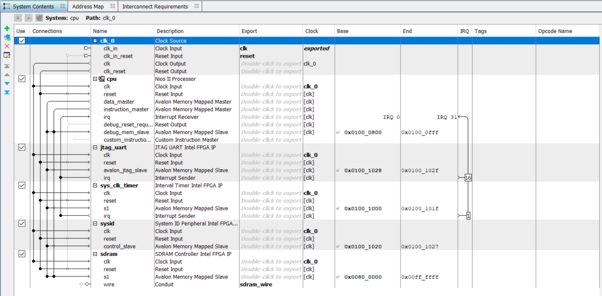
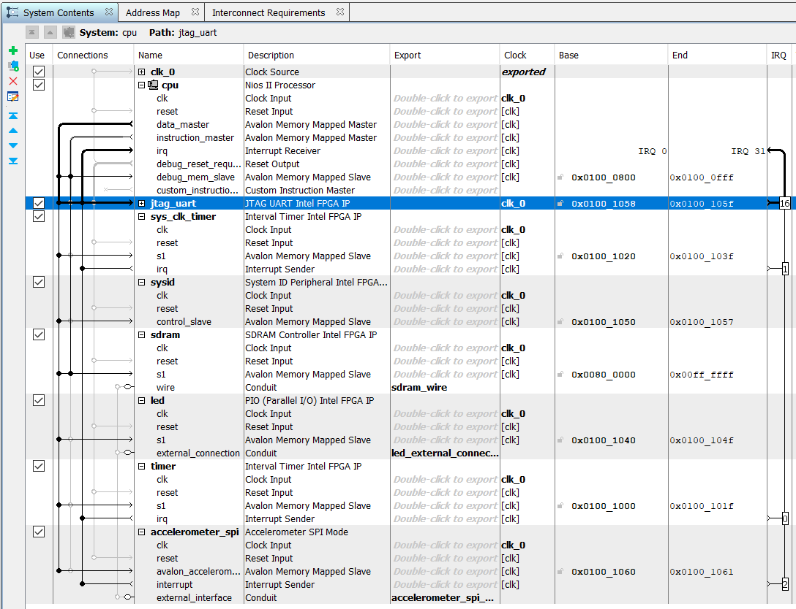

Establishing communication of a NIOS II system with a host PC, including custom and required functions and commands for this to occur. Then adding off-chip memory to the system.
this will allow us to integrate UART with Lab3 to :
- update the coefficients 
- convert characters to numbers
- Plot received accelerometer data

## Table of Contents
1. [Background](#background)
2. [Task 1: UART communication with NIOS](#task-1-uart-communication-with-nios)
3. [Task 2: Lab 3 system with Modes](#task-2-lab-3-system-with-modes)
4. [Challenge 1: Update Coefficients remotely](#challenge-1-update-coefficients-remotely)
5. [Challenge 2: Plotting Accelerometer data in real-time](#challenge-2-plotting-accelerometer-data-in-real-time)

---
## Background
### Off-chip memory
This is any memory not on the same board as the main CPU such as:
- DDR (RAM) Memory
- Graphics (GDDR) Memory - for GPUs
- HBM Memory - High Bandwidth Memory designed for GPUs. This is more expensive but offers higher bandwidth and is more power efficient.
On chip memory is covered by:
- Instruction and Data cache
- on-chip SRAM

High Bandwidth Memory is vertically stacked DRAM memory interconnected by Through-Silicon Vias (TSVs) which are vertical electrical connections tat run through the silicon dies to enable high speed communication.
The base die is a Logic die that contains the logic circuitry for memory control and data routing and this manages tasks such as error correction, data buffering ,timing control.
The physical layer acts as the interface between the HBM stack ad logic die connecting to the interposer which links to the CPU/GPU/SoC Die.
This is all hosted on a physical base, the package substrate for the motherboard/system level PCB.



Each HBM stack has a wide memory interface with thousands of bits per transfer, so higher bandwidth at lower clock speeds. This is often 1024 bits per stack (HBM2) vs 64 bits per channel (DDR4). Further the vertical stacking and using microbumps means there is a shorter path between each HBM die rather than DDR RAM which is physically located away and a single layer.

This results in a bandwidth of up to 256GBps (HBM2) vs 25.6GBps (DDR4).
### UART communication
Further to the background in the previous lab: [./lab3-docs](./lab3-docs)

UART is used for device to device communication and uses 2 wires. This operates at an agreed frequency of reading known as baud rate.

|     1     |    5-9     |     0-1     |    1-2    |
| :-------: | :--------: | :---------: | :-------: |
| Start Bit | Data Frame | Parity Bits | Stop Bits |

---
## Task 1: UART communication with NIOS
We are provided with a design that allows NIOS II to communicate with the host PC via UART, with the addition of off-chip memory.
This system also includes a PLL (Phase Locked Loop) which generates a signal whose phase is related to an input signal.
As signals to/from off-chip memory exhibit delays, a phase shift is used to drive the off-chip memory related to NIOS II for the data to be registered for a full clock cycle.

Looking through this provided design, we see that `jtag-uart-test` has a `hello_world.qpf` file that contains a schematic, `hello_world.bdf` along with a `.qsys` file for system configuration, `.qip` and `.sip` files for the PLLs.

>[!NOTE]
>A `*.bdf` file is a Block Diagram File with a visual format rather than HDL

The block diagram shows that the system is clock driver by `iCLK` and also has a buffer `clk_sip` for the SDRAM and CPU. The SDRAM contains interface signals/Busses for Addressing, Data, Control and Clock (synchronisation).
There is also an output to the LEDs in addition to `PIN_J21` and `PIN_V22` which may be connected to external hardware.


Looking at the `.qsys` file will give us more information on the system hardware:


Alongside this design, there is a python script (`host.py`) for the host and `task1.c` for the the board side. The host program:
- sends signals to the board
- waits for a response
- processes the response
This puts the NIOS into slave mode.
The board side will:
- read incoming characters
- A running variable ensures this runs indefinitely until QUITLETTER is received. QUITLETTER is a constant which is `~` in this case.
- Inside the while loop, `alt_getchar()` reads a single character from the jtag_uart port and stalls until a new character arrives.
- The first character fills the text buffer and is checked for the quitting character
- This is then added to the buffer and text index pointer is incremented, continuing until a newline character (`\n`) is encountered.
- The text is then printed back to the host terminal and a string ending in `0x4` or `Ctrl+D`  is generated and sent to the host for signal termination.
- The text buffer is then cleared for the next input .

We can start the board side by first running `hello_world_time_limited.sof` via Programmer. This runs for 1 hour.
In Eclipse, we then create a new software project using `jtag-uart-test\qsys_system\cpu.sopcinfo` and adding the `task1.c` script to this.

Then we can use terminal to download the generated `.elf` file to the DE10-Lite board.
We can then type in:
```powershell
    $ nios2-terminal.exe <<< hello
    nios2-terminal: connected to hardware target using JTAG UART on cable
    nios2-terminal: "USB-Blaster [USB-0]", device 1, instance 0
    nios2-terminal: (Use the IDE stop button or Ctrl-C to terminate)
    <--> Detected 5 characters: hello <-->
    nios2-terminal: exiting due to ^D on remote
```
   
 >[!Warning]
>This may require the command to be run twice, if the first time it is invalid.

In the same powershell instance, we can run `python host.py` which is the same as previous but the user is required to parameterise the input string and process the output from the board.

```powershell
$ python host.py
b'\x1b]2;Altera Nios II EDS 18.1 [gcc4]\x07
Altera Nios2 Command Shell [GCC 4]
Version 18.1, Build 625
nnios2-terminal: connected to hardware target using JTAG UART on cable
nios2-terminal: "USB-Blaster [USB-0]", device 1, instance 0
nios2-terminal: (Use the IDE stop button or Ctrl-C to terminate)
<--> Detected 7 characters: testing <--> 

nios2-terminal: exiting due to ^D on remote\r\n'
```

---
## Task 2: Lab 3 system with Modes

Now that we have a working system, we can integrate this with Lab 3.
Remembering that we had 3 states/modes, each increasing in sampling frequency:

| Mode | Function             | Descripion                          |
| ---- | -------------------- | ----------------------------------- |
| 0    |                      | No filtering of accelerometer data  |
| 1    | `fir_filter()`       | filtering the accelerometer data    |
| 2    | `fir_filter_fixed()` | fixed-point and quantised filtering |

The structure of our program needs to have the same functions as defined in `task1.c` but also with a case select statement that runs continuously and outputs depending on the user's input. We can do this by:
- Hardware integration of NIOS II system
- C script with select case to switch between the states.

We can extend this by looking at `DE_seven_segment_display.c` from lab 2 which makes use of a push button to change the text, in this case that will change the mode.

### Software Integration
We can split the process up into several stages:
1. Libraries and constants
2. Accelerometer setup
3. Host-Client setup
4. Mode function
5. `int main()`

**1. Libraries and constants**
We can simply accumulate the libraries from both software implementations and do the same for the constants. 

**2. Accelerometer Setup**
Replicating the code from lab 3.

**3. Host-Client setup**
Replicating the code from the start of lab 4.

**4. Mode function**
To get the mode, we can follow the same as `task1.c`.
We can then convert this value to an integer by `atoi()` -> requires the `<stdlib.h>` library.
We can then empty the text buffer for the next input.
```C
void get_mode(char *text, int mode){
    char *printMsg;
    mode = atoi(text);
    asprintf(&printMsg, "<--> Mode selected: %d <-->\n %c", mode, 0x4);
    alt_putstr(printMsg);
    free(printMsg);
    memset(text, 0, 2 * CHARLIM);
}
```

**5. `int main()`**
We can begin by setting up the accelerometer.
Then declaring the `mode` variable and reading the input and assigning it to this variable.
Within the while loop, we can read the accelerometer value and then depending on the value of `mode`, change how the accelerometer data is handled and is then output to the LEDs..
```C
int main()
{
	alt_32 x_read;
	alt_up_accelerometer_spi_dev * acc_dev;
	acc_dev = alt_up_accelerometer_spi_open_dev("/dev/accelerometer_spi");
	if (acc_dev == NULL) {
		return 1;
	}
	timer_init(sys_timer_isr);
	int mode = 0;
    read_chars(mode);
    while (1) {
    	alt_up_accelerometer_spi_read_x_axis(acc_dev, & x_read);
    	switch (mode) {
    	case 0:
    		int32_t filtered_reading = x_read;
    	case 1:
    		int32_t filtered_reading = fir_filter(x_read);
    	case 2:
    		int32_t filtered_reading = fir_filter_fixed(x_read);
    	default:
    		int32_t filtered_reading = x_read;
    	}
    	convert_read(filtered_reading, & level, & led);
    }
}
```

### Hardware Integration
The `.qsys` file above can be modified to include the functionality from lab 3.
We need to add the following to this schematic:
- LED (10 bit output PIO)
- Timer (FPGA Timer)
- Accelerometer SPI mode

Adding all the required connections and exporting the necessary parts, we end up with this:

Now we can generate the HDL and link this to the Project in Quartus.

We can add the configuration script from the `cpu_instr.v` file and append it to the `DE10_Golden_Top.v`. This can now be added to the project. 


---
## Challenge 1: Update Coefficients remotely


---
## Challenge 2: Plotting Accelerometer data in real-time


