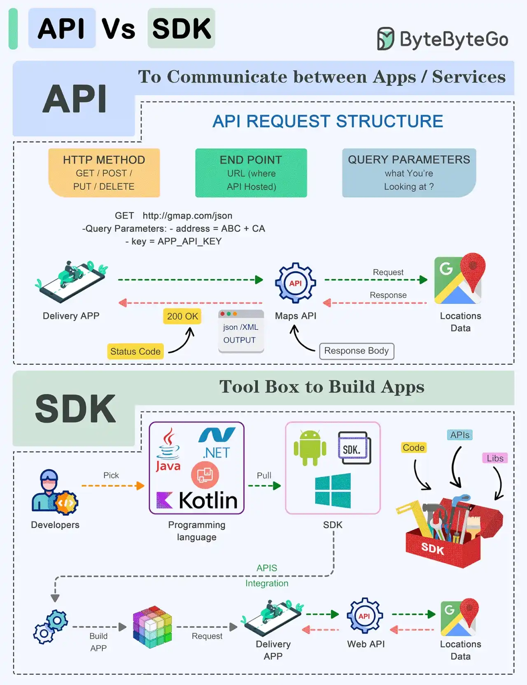

Using DynamoDB with EC2 - Python based

With EC2 setup in [lab5](./lab5-docs.md), we can write a python script to connect to a DynamoDB.
This can be set up with a TCP client on our local machine to accept data and relay it to the TCP server on EC2. The server can then invoke methods in the dbmanager to store this data into DynamoDB.

## Table of Contents
1. boto3
2. DynamoDB and relational databases
3. Exercises
4. PostgreSQL

---
## Boto3
Boto3 is the AWS SDK for Python. This is used to integrate a python application, library or script with AWS services.

An SDK has additional benefits over an API since we can build apps with this, and not just communicate:

Specifically for Aws, this means we can use these platform specific tools to write programs faster due to Boto3 consisting of consists of libraries, compilers, debuggers, code samples, and documentation. An IDE helps to connect all the tools from the SDK.
[https://aws.amazon.com/compare/the-difference-between-sdk-and-api/]() 

Accessing boto3, can be via the following commands in our linux environment:
```bash
sudo apt-get update
sudo apt-get -y install python3-boto3
```

>[!NOTE]
>This is also available via windows with:
>```bash
>pip install boto3
>```

Once we have done this, we can explore the following options:
- We can setup PuTTY, FileZilla and the EC2 instance and run the python scripts inside.

- We can specify the credentials in `~/.aws/credentials` - if not present, then we will need to create this with `touch credentials` or `"" > credentials` and this should contain:
```text
[default]
aws_access_key_id = YOUR_KEY
aws_secret_access_key = YOUR_SECRET
```
and the default region in `~/.aws/config` with:
```text
[default]
region=us-east-1
```

---
## DynamoDB

Covering basic operations: table creation, loading sample data, CRUD operations, query and scan data, delete table.
[https://docs.aws.amazon.com/amazondynamodb/latest/developerguide/programming-with-python.html]()

### Creating a table
The script is provided in [../lab6/python scripts/MoviesCreateTable.py]()

Here, we use an object oriented interface and runs by:
-  checking if dynamodb exists or not.
	- If not then we will create a database with boto3 specified as:
```python
dynamodb = boto3.resouce('dynamodb', region_name='us-east-1')
```

>[!ERROR]
>WHY `us-east-1` and not `eu-west-2`?

- Setting the table name to `Movies`
- Set the Key Schema to `year` and `title` with the types `N` and `S` and specifying the number of reads and writes per second:

| `year`                 | `title`            |
| ---------------------- | ------------------ |
| `HASH` (Partition Key) | `RANGE` (Sort Key) |
| `N` (Number)           | `S` (String)       |
Total Read Capacity = Total Write Capacity = 10 per second

So `year` is used to distribute data across partitions and `title` for sorting the data. 

### Loading Sample data
For ease of use, we can specify the records in a JSON format:
```json
{
        "year": <YEAR>,
        "title": <TITLE>,
        "info": {
            "directors": [<DIR1>, <DIR2>, ...],
            "release_date": <REL-DATE>,
            "rating": <RATING>,
            "genres": [<GENRE1>, <GENRE2>, ...],
            "image_url": ,
            "rank": <RANK>,
            "running_time_secs": <RUN-TIME>,
            "actors": [<ACTOR1>, <ACTOR2>, ...]
        }
    },
```
With `year` and `title` as the primary key (specified when defining Movies)

A python script can be simply designed to parse through all the data in the json file, and for each entry add the item to the database specifying the primary keys.

### CRUD Operations
**Create**
We can define a function to take in the inputs for the title, year, plot, rating and enter the fields whenever we want to add a new record. This will put it in json format and add it to the database.

**Reading**
We can use the primary key to read an item by defining a function that gets the year and title of the movie required via `.get_item()`

**Update**
Similar to reading, we can access and update an item by `.update_item()`.
Here, we specify the Key, UpdateExpression, ExpressionAttributeValues, ReturnValues.

Note that UpdateExpression is used to describe the changes we wish to see in the item. This means that we:
- Write the expression with placeholders e.g. `:r`, `:p`, `:a`
- Specify the values of the placeholders in the ExpressionAttributeValues

**Delete**
Similarly, this is done via `.delete_item()` and specifying the primary key.

This also has a field for ConditionExpression that can use a placeholder again e.g.`:val` and specified in the ExpressionAttrubuteValues for an expression e.g. delete any film with a rating less than 5.

### Query
Using the `.query()` method, we need to specify the:
- Partition Key
- Sort Key (optional)
Additional parameters can be specified.
[https://docs.aws.amazon.com/amazondynamodb/latest/developerguide/Query.html]()
### Scan
Using the `scan()` method and `filter_expression` to  return elements matching  criteria - like query, but to apply expressions on the partition key.

This is structured so that when dynamoDB applied and returns the results of queries, it scans one page at a time (max page size = 1MB) - Pagination.
A while loop is used to re-call the scan function as long as there are more pages to filter results from.
The response part, maintains an attribute LastEvaluatedKey which is not None if there are more pages following the current one.
Scanning begins from the key pointed to by the ExclusiveStartKey parameter which is at the top of the page here.

[https://docs.aws.amazon.com/amazondynamodb/latest/developerguide/Scan.html]()

### Delete

This is simply `.delete()`


---

## Exercises
After recreating the table, we are to:
1. Print the titles of all movies released in 1994. 
2. Print complete information on the movie ‘After Hours’ released in 1985. 
3. Print all movies released before 2000. 
4. Print only the years and titles of movies starring Tom Hanks. 
>[!ERROR]
>No 4 may require correction
5. Remove all movies released before 2000.


The implementation for each of these is shown in the python script folder.

---

## PostgreSQL

We can Install this on the EC2 system via:
```bash
sudo apt-get update
sudo apt-get install postgresql postgresql-contrib 
```

The default user is `postgres` and to change the password:
```bash
sudo -u postgres psql
\password
```

And then enter the new password, then `\q` to exit postgres.

### Configuration changes
Edit the `pg_hba.conf` in vim:
```bash
sudo vim /etc/postgresql/10/main/pg_hba.conf
```
and add the following to to allow for remote access:
```text
host  all       all        0.0.0.0/0      md5
```

Then edit the next file:
```bash
sudo vim /etc/postgresql/10/main/postgresql.conf
```
and change line 59 to listen to external requests:
```text
listen_address='*'
```

Now we can restart the server for the changes to take effect:
```shell
sudo /etc/init.d/postgresql restart
```

Finally we can create a user in postgres:
```bash
sudo su postgres
psql
```


### Using Postgresql

Example commands:
```shell
CREATE DATABASE <database_name>; 
CREATE USER <user> with encrypted password '<password>';
GRANT ALL PRIVILEGES ON DATABASE <database_name> TO <user>;
```
