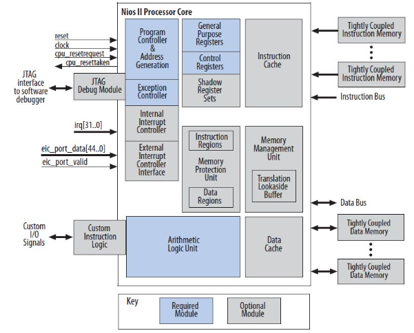
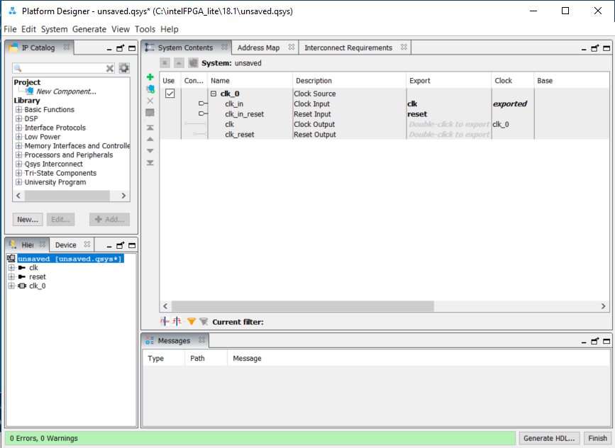
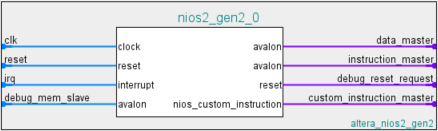
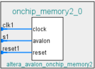
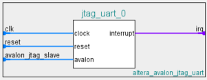
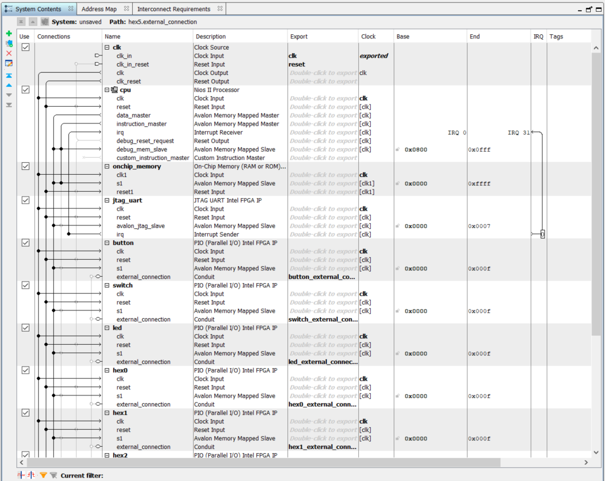
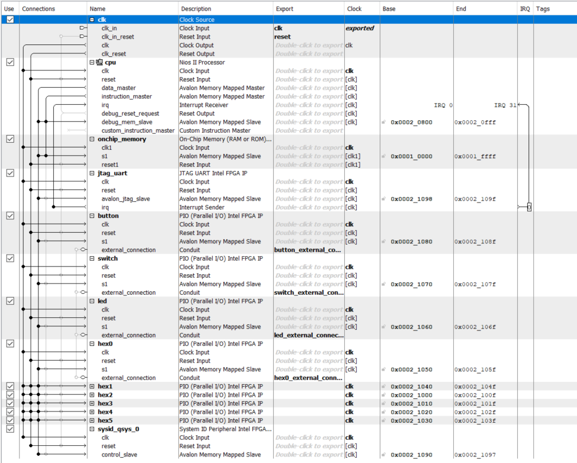
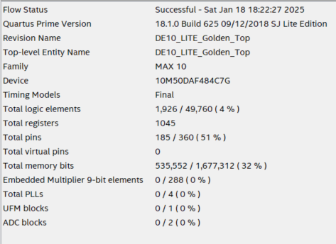
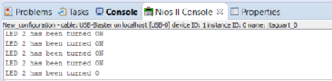

This lab focuses on the process of designing and deploying a **NIOS II system**, culminating in the creation of a CLI-based program that runs on the Max10 FPGA chip, which is integrated into the DE10-Lite board. 
This involves the design, programming, and testing of an embedded system, leveraging the capabilities of the NIOS II system.
Also see the [Hello_World_Lab_Manual](./Hello_World_Lab_Manual_DE10_Lite.pdf)
## Table of Contents
1. Subdirectory structure
2. Background
3. Task 1: Designing an NIOS II System
4. Task 2: Programming an NIOS II System
5. Task 3: Extension & Challenges
6. Troubleshooting and issues encountered
---
## ==Subdirectory Structure==

---
## Background
In this lab, we are using the 32-bit NIOS II soft-core processor which is implemented in the FPGA fabric.

Soft-core processors have customisable architecture, as opposed to fixed architecture in hard-core processors. The processor architecture contains Register files, ALU, iCache and dCache, Instruction decoding and Instruction bus and data bus.
This is similar to the Harvard architecture of a processor with Instruction and Data kept separate. 


The blue boxes show the essential components:
- Instruction-fetch-decode logic
- Registers (32 32-bit registers)
- Exception Logic
- ALU
This is a typical RISC architecture
The grey boxes show the optional elements to enhance capability:
- Shadow Registers: Reduce overhead when switching between functions by moving 32 registers from main to here as opposed to using a stack (for interrupts).
- dCache and iCache: Especially useful if Nios II is located off-chip. Also cache-bypass methods for specific instructions.
- Memory Management Unit: Can be added to implement virtual memory and memory protection making it secure for OS hosting. 
- Tightly Coupled memory: memory bandwidth often limits performance, but with TCM, there is no data/memory bottleneck since the memory is directly handled by the programmer.
- Custom Instructions: Saves time and enhances performance.

This means that it has a portable design, capable of running on any FPGA that can synthesize the NIOS II Verilog. However, this is configured as bitstream, as opposed to running on silicon resulting in less performance and lower energy efficiency 
[Introduction to NIOS II by Cornell](https://people.ece.cornell.edu/land/courses/ece5760/DE2/tut_nios2_introduction.pdf)

---
## Task 1: Designing an NIOS II System
**Tldr**: instantiate a soft processor (NIOS II) on the FPGA, establish a communication with the host-PC and display a message on the terminal.

Since the Nios II processor is supported by a lot of peripherals and 'IP' blocks that can be configured and connected, we can use the QSys tool to make this easier.
The complete design of the system is to use:
- QSys/Platform Designer: Select an IP to make connections and generate a system
- Quartus: FPGA Design with HDL files (like Lab 1)
	- Editing hardware spec, assigning Pin-out, timing constraints, compilation and downloading
- NIOS II: Software Development when building, debugging and running applications.
- Target Hardware (FPGA device): Download and run the application built on NIOS II with the hardware spec defined by the Quartus HDL files.

Initially, we aim to build a system with a clock and a single master (the Nios II processor) with 11 slave devices.

### Adding an NIOS II Processor
We begin by launching the Platform Designer inside Quartus via `Tools > Platform designer`.

This automatically opens with the clock module as `clk_0`
Here we find the Nios II Processor through the IP catalog.
This opens a panel with more details. (Here we use Nios II/e)
> Note that Nios II has several versions with /e (economy), /f (fast) and /s (standard)

This also shows an image of the soft processor architecture:

To connect this with the rest of our processor, we can simply draw lines in the connections column, but it is easier to do this with all the components present.

### Adding other components
We still need to add:
- On Chip Memory 
	- Uninitialised memory content for `On-Chip Memory (RAM or ROM) Intel FPGA IP` with size `65536` bytes.
	 
	 > Avalon is a combination of control signals such as instruction and data for reading and writing.
- JTAG UART
	- `JTAG UART Intel FPGA IP` is used for the debugging interface and communication via the terminal.
	 
- Parallel IO (PIO) which handles:
	- Pushbutton Inputs (`pio_0`)
		- 4-bit input interface (2 push buttons and 2 internal signals)
	- Switch Inputs (`pio_1`)
		- 10-bit input interface (per switch)
	- LED Output (`pio_2`)
		- 10-bit output for 10 LEDs
	- 7-segment displays (`pio_3`)
		- 7-bit output
Since our processor on the DE10-Lite board contains this instrumentation.

### Connecting all components together


We have added all the connections and duplicated the 7 segment displays. 
In addition, we have exported the conduit for the Parallel I/O connectors that allow us to use these and address them in the top level design (HDL).

To make debugging easier later on, we also make use of the `System ID Peripheral Interl FPGA IP` module.

We also assign the base addresses.


### Managing Errors
Currently we also see 2 errors. These are for Reset Slave is not specified and the exception slave is not specified.
To fix this, we can go to the vectors tab of the cpu and set the `reset vector memory` and `exception vector memory` to `onchip_memory.s1` . This sets the system to execute from the onchip memory, thus resolving the memory issues.

Finally we can generate the HDL files

### Connecting the project to NIOS II
Inside the top module, we can add the following script (edited from the `nios_setup_v2_inst.v` file):
```Verilog
nios_setup_v2 system (
		.clk_clk                           (MAX10_CLK1_50),  
		.reset_reset_n                     (1'b1),           
		.button_external_connection_export (KEY[1:0]),       
		.switch_external_connection_export (SW[9:0]),        
		.led_external_connection_export    (LEDR[9:0]),      
		.hex0_external_connection_export   (HEX0),           
		.hex1_external_connection_export   (HEX1),           
		.hex2_external_connection_export   (HEX2),           
		.hex3_external_connection_export   (HEX3),           
		.hex4_external_connection_export   (HEX4),           
		.hex5_external_connection_export   (HEX5)           
	);
```
This is added in the `DE10_LITE_Golden_Top.v` provided file.

Now to add the rest of the files, we can go to `Project > Add/Remove Files in Project` and add the `nios_setup_v2.qsys` files.

For the Pin assignment, this has been done already with the script included.
We can finally compile this which also runs Analysis/Synthesis, Fitter, Assembler, TimeQuest.
In other words, it places and route the script for the FPGA, generates the programming image and the static time analyser.

This takes ~6 minutes and results in the following compilation report (flow summary)


---
## Task 2: Programming an NIOS II System
Version 18.1 of Quartus has an in built eclipse ide which can be launched by `Tools > NIOS II Software Build tools for eclipse`.

We then create a new hello-world application from a template including a board support package to translate commands such as `printf`. This is done by:
`New > Nios II Application and BSP from Template`  then selecting the relevant `*.sopcinfo` containing the Qsys system contents for eclipse.
Then selecting the `Hello World Small` template that enables us to write `Hello from Nios II` to STDOUT with little memory overhead.

Now we can modify this to display the results of pushbuttons (KEY1-0) on LEDs 3-2.
Opening `hello_world_small.c` presents us with a file with only:
```c
alt_putstr("Hello from Nios II!\n");
```
This pushes a command to the output via the Hardware Abstraction Layer (HAL) libraries as part of the Altera's software functions.

To add a library definition, integer switch_datain and other HAL functions, we can make use of the `DE_hello_world.c` file already provided containing the key lines:
```C
int main()
{
    int switch_datain;
    alt_putstr("Hello from Nios II!\n");
    alt_putstr("When you press Push Button 0,1 the switching on of the LEDs is done by software\n");
    alt_putstr("But, Switching on/off of LED 2 by SW 2 is done by hardware\n");

    while (1)
    {
        switch_datain = ~IORD_ALTERA_AVALON_PIO_DATA(BUTTON_BASE);
        switch_datain &= (0b0000000011);
        IOWR_ALTERA_AVALON_PIO_DATA(LED_BASE,switch_datain);
    }
    return 0;
}
```
This program gets the data from the `BUTTON_BASE` and reads it into a variable (where 0 means a button is pressed). We then mask the bits so the leftmost LEDs are always off since we only care about LEDs 3-0 then sending this to write to the LEDs.

Next, we can generate the BSP from `hello_world_sw_bsp > Nios II > Generate BSP` which provides the configuration for the Nios II on the FPGA.
To run the program, we save it, right click on `hello_world_sw` and then build the project. This creates an `.elf` file (executable loadable file). 

Before we continue, we need to run the given golden_top `.sof` file on the FPGA.
Now we can run the C program by right clicking `hello_world_sw` then `Run As > Run Configurations > Nios II Hardware > Target Connection`

> Note that this also had Timestamp mismatch issues, could not find appropriate method to resolve this so is temporarily ignored.

> To download the `.elf` file, run the batch file in terminal then navigate to the location for the `.elf` file and download it using `nios2-download`:
>     ```bash
	& 'C:\intelFPGA_lite\18.1std\nios2eds\Nios II Command Shell.bat'
	cd <your_elf_file_directory>
	nios2-download -g <your_elf_file_name>.elf
	```


Adding the following script will test the STDOUT:
```C
if (switch_datain == 0b0000000000) {
			alt_putstr("Both LEDs are turned ON\n");
		}
		else if (switch_datain == 0b0000000010) {
			alt_putstr("LED 1 has been turned ON\n");
		}
		else if (switch_datain == 0b0000000001) {
			alt_putstr("LED 2 has been turned ON\n");
		}
```
And this works as expected with the following output in the Nios II console:


The LEDs corresponding to each button can be shown here:

|  |  |
| ---------------------------- | ---------------------------- |

---
## Task 3: Extension and Challenges
Now we can make changes to the `hello_world.c` program to light up the LEDs in sequence.

Looking at the `system.h` file, we can see that the base of other Parallel Input/Output devices follows the same pattern as the provided switch and LEDs. 
Creating a pattern for the LED, we can have a circulating pattern with a series of 1s and 0s.
The implementation is simply:
```C
if (switch_datain & 0b01) {
            IOWR_ALTERA_AVALON_PIO_DATA(LED_BASE, led_pattern[pattern_index]);
            pattern_index = (pattern_index + 1) % 14;
            usleep(DELAY);
        }
```
Similarly, for the 7 segment displays, we can have 3 bars iterating across all of them. This can be implemented by:
```C
else if (switch_datain & 0b10) {
            IOWR_ALTERA_AVALON_PIO_DATA(HEX0_BASE, (circle_index == 0) ? circling_pattern : 0b1111111);
            IOWR_ALTERA_AVALON_PIO_DATA(HEX1_BASE, (circle_index == 1) ? circling_pattern : 0b1111111);
            IOWR_ALTERA_AVALON_PIO_DATA(HEX2_BASE, (circle_index == 2) ? circling_pattern : 0b1111111);
            IOWR_ALTERA_AVALON_PIO_DATA(HEX3_BASE, (circle_index == 3) ? circling_pattern : 0b1111111);
            IOWR_ALTERA_AVALON_PIO_DATA(HEX4_BASE, (circle_index == 4) ? circling_pattern : 0b1111111);
            IOWR_ALTERA_AVALON_PIO_DATA(HEX5_BASE, (circle_index == 5) ? circling_pattern : 0b1111111);

            circle_index = (circle_index + 1) % 6; 
            usleep(DELAY * 3);
        }
```

We can also add in a delay by defining a constant and then use `usleep()` for delaying in microseconds.

Now we have the following patterns displayed:

